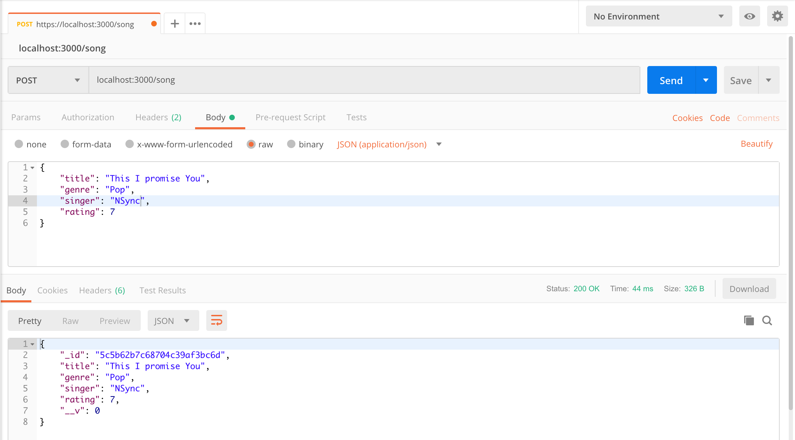
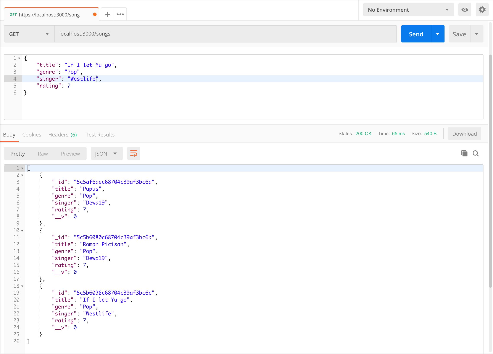
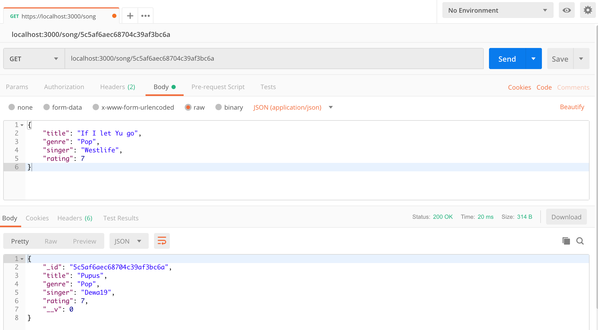
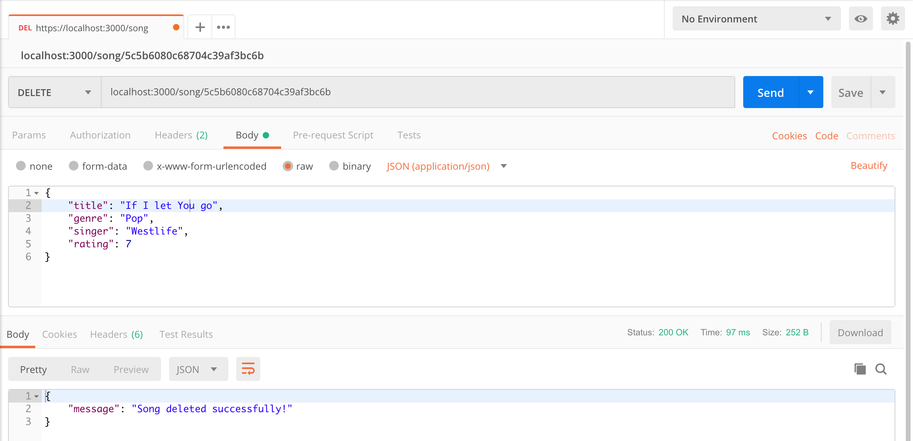

# nodejs-express-crud-song-api

#### Things to do :

1. `git clone git@github.com:hendisantika/nodejs-express-crud-song-api.git`
2. `cd nodejs-express-crud-song-api`
3. `npm install`
4. `node index.js`

#### Screen shot

Add new Song data

`POST /song`

```json
{
	"title": "Pupus",
    "genre": "Pop",
    "singer": "Dewa19",
	"rating": 7
}
```



Get all songs

`GET /songs`



Get song by Id

`GET /song/:songId`
```json
localhost:3000/song/5c5af6aec68704c39af3bc6a
```



Update song by Id

`PUT /song/songId`


Delete Song

`DELETE /song/:songId `

